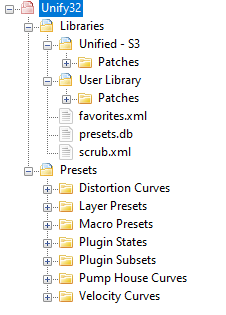

# Unify folders and files

See [this page in the Unify manual](https://pluginguru.net/unify/manual/doku.php?id=files-folders) for details about the many files Unify uses.

All Unify *patch files* (sound-preset files) live under the main Unify data folder, which lives wherever the user decides to keep it. (Unify saves the path to the main data folder in the *Unify.settings* file.) Here's a view of a simple Unify data folder I use here for testing:

Inside the *Libraries* folder there are two library folders, *Unified - S3* and *User Library*. Inside each of these there is a *Patches* folder, which contains the patch files (see below).

Individual library folders will often contain other sub-folders beside the *Patches* folder. These aren't important for this project.

## Patches vs Presets

Unify knows about several different kinds of "presets". The "presets" that are listed in the [patch browser](https://pluginguru.net/unify/manual/doku.php?id=playing-patches#using_the_patch_browser_sidebar) are called *Patches*. We use the word "preset" for *every other kind of preset*.

For this project, we are only interested in patch files.

## Patch files: .unify vs .upf

Unify saves new patches into files with the extension `.unify`, whose format is described in detail in [this document](Unify-patch-structure.md). All Unify patches start out as `.unify` files, and these are what the *LibraryRenamer* program processes.

For all *paid* Unify libraries (and also certain free ones like the *Unify Demo Library*), patch files are distributed as `.upf` (Unify patch format) files. These are *encrypted versions* of the corresponding `.unify` files. You will notice that the *Patches* folder in your *Unify Standard Library* folder contains only `.upf` files, while the *Patches* folder in your *User Library* folder contains only `.unify` files.

