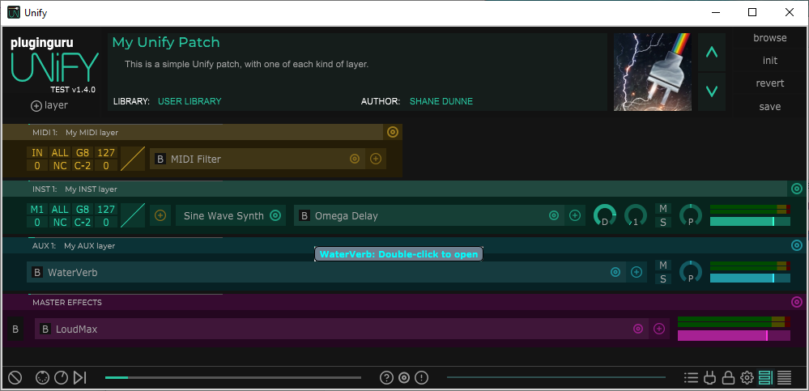

# Unify patch structure
Unify patch files (`.unify`) are basically XML files, but they are stored as `juce::MemoryBlock` objects, so they have a small binary header containing a byte count before the XML, and a single zero byte after.

See the [Utilities folder](../Utilities) for couple of small Python scripts to convert `.unify` files to `.xml` and vice versa.

The rest of this document concentrates entirely on the XML structure inside `.unify` files.

## Example Unify patch

Consider this simple Unify patch, which has one of every kind of layer:

The file [My Unify Patch.xml](https://github.com/getdunne/unify-batch/blob/main/Documents/My%20Unify%20Patch.xml) contains a pretty-printed version of the XML between the binary header and trailer bytes of the *My Unify Patch.unify* file. Open the XML file in a good syntax-coloring text editor like [Notepad++](https://notepad-plus-plus.org/downloads/) to explore the structure.

## Basic structure of patch XML

- *UnifyPreset*
  - *PresetMetadata* (mandatory, always one)
  - *bpmData* (zero or one)
  - *Layer* (= INST layer, always at least one, maybe many)
  - *MidiLane* (= MIDI layer, zero or more)
  - *AudioFxLane* (= AUX or MASTER EFFECTS layer, always at least one, 1st is MASTER)
  - *MacroParameter* (8 of these in older patches, usually 32 in newer ones)

Because this is XML, every element can also have simple *attributes* that are attached to the element itself.

The *PresetMetadata* element contains the patch name, description, author, etc., all encoded using attributes.

### Layers: Layer, MidiLane, AudioFxLane

The *MidiLane*, *Layer*, and *AudioFxLane* elements correspond to the MIDI, INST, and AUX/MASTER layers in the patch, respectively. They all have the same basic structure, based on that of Layer (the most complex):

- *Layer*
  - *Instrument* (mandatory, always one)
  - *MidiVelCurve* (mandatory, always one)
  - *MidiInserts* (might be empty)
    - *MidiEffect* (zero or more)
  - *AudioInserts* (might be empty)
    - *InsertEffect* (zero or more)

*MidiLane* elements are the same, but contain only a *MidiVelCurve* and *MidiInserts* elements.

*AudioFxLane* elements contain only an *AudioInserts* element. Unify treats the first *AudioFxLane* element as the MASTER EFFECTS layer, which must always be present; hence there will always be at least one *AudioFxLane* element present, and there will be more if there are also any AUX layers.

### Plug-ins: Instrument, MidiEffect, InsertEffect

*Instrument*, *MidiEffect*, and *InsertEffect* elements all represent individual plug-in instances.

They all contain a *PLUGIN* element, which specifies the plug-in to use, and a *stateInformation* text-attribute which stores the saved plug-in state (which Unify will restore with a call to `juce::AudioPluginInstance::setStateInformation()`).

### stateInformation

When saving a patch, Unify calls `juce::AudioPluginInstance::getStateInformation()` on each plug-in instance, to get its current state, in the form of a `juce::MemoryBlock` object, then calls `toBase64Encoding()` on that `juce::MemoryBlock`, and puts the resulting base-64 encoded string into the *stateInformation* attribute of the *Instrument*, *MidiEffect*, or *InsertEffect* element representing that plug-in instance.

In the *LibraryRenamer* code, you'll see several places where these steps are reversed, to recover the actual state-data (almost always an XML string), which is then modified, converted back to a base-64 string, and re-stored.