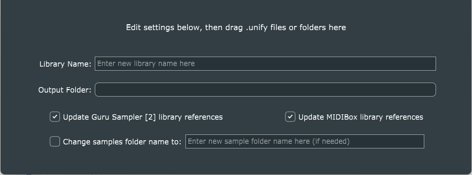

# LibraryRenamer
This program was originally developed simply for renaming Unify patch libraries; hence the name.

Changing the name of a Unify patch is not a simple thing, because several plug-ins save the library name in their state-data blobs. Hence *LibraryRenamer* has to parse, update, and re-save these data blobs. Also, both *Unify* and the built-in *ComboBox* plug-in can contain other plug-ins, so the process must be recursive.

To understand this code, you need to learn about [the structure of Unify patch files](../Documents/Unify-patch-structure.md).

### GUI and usage

Enter the new library name you want in the "Library Name" text box.

If you would like the updated patch files saved to a different folder, click the "Output Folder" button and select the target folder. If you don't do this, the input files will be overwritten, so it's wise to make a safe copy first.

Unify patch files contain embedded references to sample files (for *Guru Sampler*) and MIDI files (for *MIDIBox*). *LibraryRenamer* normally updates these to be relative to your new library name, with one exception: any references to files in the *Unify Standard Library* are always left unchanged.

When renaming a library you have built for yourself, you may wish to disable these reference updates, because your patches may refer to files in arbitrary locations. The two checkboxes on the second-lowest row of the GUI allow for this.

If your library includes its own samples, these are stored in sub-folders under the library's own *Samples* folder. When there is only one such sub-folder, it is most commonly given the same name as the library itself, but this can be cumbersome if the library name is long. If you would prefer a shorter name, check the box at the very bottom of the GUI and enter the name you want at the bottom right.

For example, the patch library called *Subsonic Artz Repro Cybernetica* has all its custom samples inside a single sub-folder called simply *CyberneticA* under its *Samples* folder. To maintain this custom sub-folder name when renaming this library, the bottom box would be checked and "CyberneticA" would be entered at the bottom right.

Note the *Library Renamer* program isn't very sophisticated. If your library has multiple sub-folders under its *Samples* folder, you will just have to pick one to use in this way, and then manually update your *Guru Sampler* or *Guru Sampler 2* instances that must refer to a different sub-folder.
