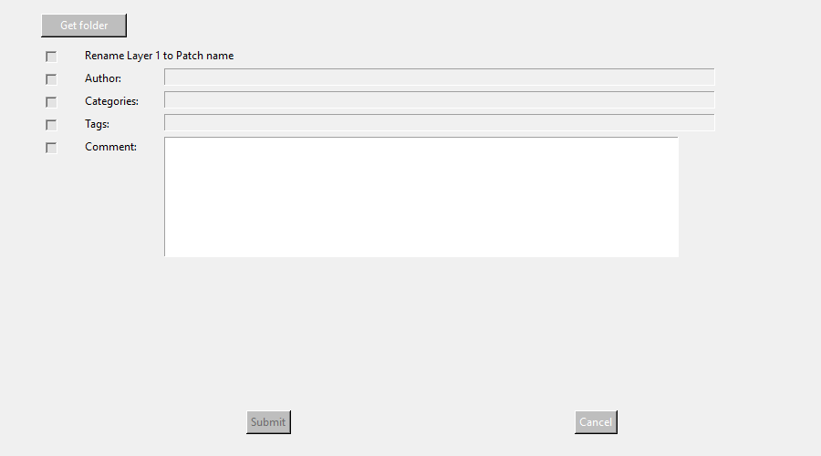

# Python metadata updater

This Python version of the metadata updater was contributed by Thomas Svensson.




## Dependencies

This program requires [tkinter](https://wiki.python.org/moin/TkInter), which in turn requires [tcl](http://www.tcl.tk/). Curiously, on my Win10 PC, the higher-level *tkinter* library seemed to be installed, but not the lower-level *tcl/tk*. I tested under both Python 2.7 and 3.7, and in both cases got the confusing error message

```
Traceback (most recent call last):
  File "UNIFY Metadata updater.py", line 161, in <module>
    window = Tk()
  File "C:\Python27\lib\lib-tk\Tkinter.py", line 1814, in __init__
    self.tk = _tkinter.create(screenName, baseName, className, interactive, wantobjects, useTk, sync, use)
_tkinter.TclError: Can't find a usable init.tcl in the following directories:
    {C:\Program Files (x86)\CSR\BlueSuite 2.6.0} C:/Python27/lib/tcl8.5 C:/lib/tcl8.5 C:/lib/tcl8.5 C:/library C:/library C:/tcl8.5.15/library C:/tcl8.5.15/library


This probably means that Tcl wasn't installed properly.

```

I executed `pip install tcl`, which seemed to work fine, but the error message remained. As usual, I found [a workable answer on StackOverflow](https://stackoverflow.com/questions/29320039/python-tkinter-throwing-tcl-error), which is that installing *tcl* creates a *tcl* folder at the top level of the Python installation (in my case, at `C:\Python27`), when in fact, the contents of that folder need to be moved into the `Lib` folder. Ah, yes, [Python - Dead Batteries Included](https://www.i-programmer.info/news/216-python/12791-python-dead-batteries-included.html). Once over this little hurdle, the program ran fine.

Happily, this program ran first time on my Mac under *macOS* 10.15.7 *Catalina*, albeit with some warnings e.g. "The system version of Tk is deprecated and may be removed in a future release."

