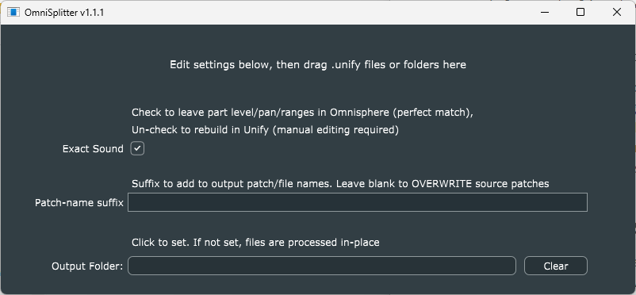

# OmniSplitter

*OmniSplitter* is a utility to automate the tedious task of reworking *Omnisphere* Multi presets for Unify. Because *Omnisphere* is not multi-threaded like Unify, each instance can only work on a single CPU core. This becomes most apparent for "multi" presets, because the work of processing the multiple layers cannot be spread across available CPU cores.

When creating "unified" versions of *Omnisphere* libraries, we would occasionally rebuild some of the "multi" presets (where there is one *Omnisphere* instance on the INST1 layer, running a "multi" preset) to a version with one INST layer per layer of the original multi preset, each with its own *Omnisphere* instance running a "slimmed down" version of the original multi with just one layer. The performance improvement could be dramatic, but doing this conversion manually proved FAR too difficult and error-prone to be practical, so I created this *OmniSplitter* utility to automate it.

## "Exact Sound" checkbox

You almost certainly want to leave this checked. We experimented with trying to replicate the multi layer level/pan settings in Unify itself, but the results were imperfect. When this box is checked, layer level and pan adjustments remain as they are in *Omnisphere*.

## Patch-name suffix

If you leave this blank, each *.unify* file you drop in will be overwritten with a new file of the same name. To avoid this, type e.g. "CONV" here, and the program will add "CONV" to both patch and file name, so you will end up with one new patch (whose name ends with "CONV") for every patch file you drag in. Note if you're working directly in a Unify library folder, you'll need to click the "lightning-bolt" icon to make these appear in the patch list.

## Output folder

Another way to avoid overwriting is to specify click the "Output Folder" item (which is actually a button, not a text box). This will open a standard folder-select dialog, allowing you to specify a different folder where the program should place its output files. Click the "Clear" button to revert to having no folder selected.

## Using the program

- Run the program by double-clicking its icon.
- Set up the GUI however you wish.
- Drag/drop any number of *.unify* patch files, OR their containing folder, into the program window to begin processing those files.
- When processing is done, the text at the top will change to indicate the number of files that were processed.

