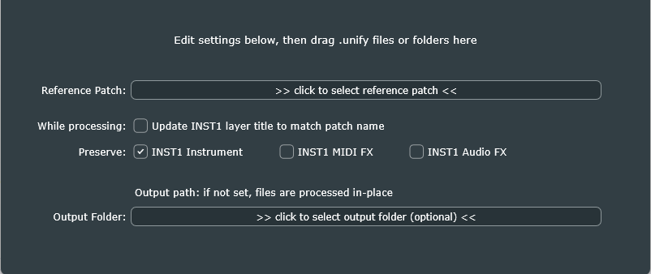

# PatchReformer

The *PatchReformer* is a tool to "re-form" multiple patches to match the structure of a *reference patch*.

When preparing Unify patch libraries (especially "unified" libraries), it's common to create all the basic patches first, just ensuring that the first INST layer has the correct instrument plug-in with the correct state. Next, a single patch (usually the first one) is completed by manually adding MIDI or audio insert-effects, AUX and MASTER layers, and macro definitions. This first patch becomes the *reference patch* for the library; every other patch is processed to match the structure of the reference patch, preserving only the state of the first INST layer. This is precisely what *PatchReformer* is for.

## "While processing" checkbox

I decided to add the "while processing, update INST1 layer title to match patch name" checkbox, because this operation is almost always needed when preparing a unified library.

## "Preserve" checkboxes

The program constructs each output patch by starting with a perfect copy of the *reference patch*, then overwrites only the state-data of the INST1 instrument plug-in with that from the input patch.

- If the "INST1 Instrument" box is checked, it also copies the plug-in details (name, vendor, format). This is particularly useful when the reference patch was created with a different plug-in (or different format e.g. VST vs. VST3) then the input patches. This is almost always what you want, so it's on by default.
- if the "INST1 MIDI FX" box is checked, any MIDI-effect plug-ins on the INST1 layer in the reference patch are replaced with those from the input patch. This is usually not what you want, so it's off by default.
- if the "INST1 Audio FX" box is checked, any audio-effect plug-ins on the INST1 layer in the reference patch are replaced with those from the input patch. This is usually not what you want, so it's off by default.

The code behind these provides useful insight into XML processing with JUCE, specifically when it's necessary to make deep-copies of an XML sub-tree, and lifetime/ownership management of same.

## Using the program

- Run the program by double-clicking its icon.
- Click the "Reference Patch" button and select the reference patch file.
  - On both Mac and Windows, this will open a standard file-open dialog
  - On the Mac, you can drag/drop the reference patch file icon directly into the file-open dialog, to automatically navigate to the folder that contains it. Then *double-click* the reference patch file's icon to select it.
  - DO NOT drag/drop the reference patch file into the file-open dialog on Windows. Instead, navigate to wherever it is, and then double-click the reference patch file icon to select it.
  - When you're done, the button text should change to the full path to the reference patch.
- If you want the INST1 layer title in all patches to be changed to match the patch name, check the box.
- Keep the "INST1 Instrument" box checked unless you really know what you're doing. (Only consider turning it off if the exact same INST1 instrument plug-in is used on the reference and all input patches.)
- If you want to preserve either the MIDI effects chain, or the Audio effects chain, or both, on the INST1 layer in all of your input patches (you probably don't), check the appropriate boxes.
- Drag/drop any number of *.unify* patch files, OR their containing folder, into the program window to begin processing those files.
- When processing is done, the "Edit settings below..." text at the top will change to indicate the number of files that were processed.

