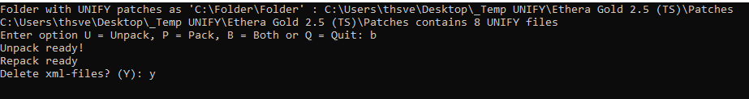

# Utilities for working with Unify patch files

## Unpack and repack

`unpack.py` and `repack.py` are simple Python programs to convert between `.unify` and `.xml` file formats.

Unify patch files (`.unify`) are basically XML files, but they are stored as `juce::BinaryData` objects, so they have a small binary header containing a byte count before the XML, and a single zero byte after.

*Unpack.py* strips off the header and trailing zero byte, turning a `.unify` file into an `.xml` file which is easy to edit and process. *Repack.py* re-creates the header and trailing zero byte, turning a (modified/edited) `.xml` file back into a `.unify` file.

Of course you can do this with JUCE code in C++, but these Python utilities are helpful if you just want to edit files manually in a text editor.

## Batch unpack and repack

`batch-unpack.py` and `batch-repack.py` are derived from `unpack.py` and `repack.py`. They are designed to be run inside a Unify library folder, without any command-line arguments.

`batch-unpack.py` loops over all `.unify` files in a sub-folder called *Patches* (which must exist), and converts each to an `.xml` file in a sub-folder called *XML* (which will be created if it does not exist).

`batch-repack.py` does the reverse: it loops over all `.xml` files in the *XML* folder and converts each to a `.unify` file in the *Patches* folder.

The idea is that you unpack the whole batch of files first, then perform operations such as text-substitution on all the XML files, then repack again.

`unify_unpack_repack.py` a script combining batch pack and repack. When the script is run, the user is prompted to specify folder for `.unify` files, options for run `(U = unpack, P = pack or Q = quit)` and whether to delete created xml files or not.

## Setting INST1 layer title to patch name

A very common operation when preparing unified libraries, where most patches consist of only one INST layer, and the patch name is derived from the name of the underlying plug-in preset, is to copy the patch name to the layer-title of the first INST layer.

`batch-name-layer1.py` is designed to be run inside a Unify library folder, with no command-line arguments, preceded by a run of `batch-unpack.py` and followed by `batch-repack.py`. It loops over all XML files in the *XML* folder, isolates the patch name, and substitutes it for the first layer's title.

## Modifying patch names, comments

Another common operation when preparing unified libraries is to make some systematic change to all the patch names, e.g. removing a suffix such as `" RX2"`.

`batch-rename.py` loops over all XML files in the *XML* folder, isolates the patch name, computes a modified version, and rewrites the XML with the modified name.

`batch-nocomment.py` is almost the same, but isolates the patch comment and deletes it.

## Swapping instrument plug-in

A user had invested a lot of effort making a unified library, but used the Audio Unit version of the target plug-in, which of course cannot be used on Windows. Because there is no algorithm to convert the saved state of an AU plug-in to an equivalent state for the corresponding VST plug-in, a compromise was needed.

`batch-swap-1st-inst.py1` (intended to be used between invocations of `batch-unpack.py` and `batch-repack.py`) locates the `<instrument>` tag from the first INST layer and swaps it for alternate text, hand-edited from another patch made using the target VST plug-in. `batch-swap-all-inst.py` is similar, but swaps ALL `<instrument>` tags on all INST layers.

The result is a version of the original unified library, where every patch retains the original name, author, comment, tags, and structure, but loads the VST version of the plug-in instead of the AU. The limitation of this approach is that all of the VST instances load the same generic preset (saved state), so it's necessary to restore the state manually in every case. A lot of work, to be sure, but a good deal less than having to start from scratch.

## Complete unpack-modify-repack loop

You may not want to bother with separate unpack, modify, and repack steps. `batch-modify.py` provides an example of how to modify all `.unify` files in a folder directly, by unpacking, processing, and repacking their contents in memory. The `batch-modify.py` script should be placed inside the target folder (sibling to all the `.unify` files to be processed) and run from there.

The actual XML modification code is isolated into a function `getModifiedXml()`, which in this script performs one simple string-replace operation, but the idea is that you could expand this into an arbitrary amount of code, including something that actually parses and operates on the XML structure.